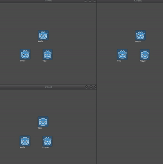

# Custom Code Overview

## Introduction
This project is substantially bigger than the GCPTutorial one. Don't worry however, most of the new code deals with having an actual game.

An important difference is how the server is setup, as this time we are having a lobby. This means players join lobby, once everyone ready, game begins. You'll notice this is exactly how the code is written as well. Lets take a look at the networking code. 

Note: I have purposefully limited functionality. The project does not know how to handle players leaving/joining after game starts, or how to handle server disconnecting. I believe it makes code easier to read as you are just starting to learn multiplayer. The next tutorial, about lobbyless servers, has all this functionality.  

## Client Networking
Most of the code is same as before. There are however a couple things to note:
```
#Main.gd
func _on_ReadyButton_pressed():
	# Tell server we are ready to join the game
	$Panel/ReadyButton.disabled = true
	gamestate.rpc_id(1, "player_ready")

# gamestate.gd
puppet func pre_start_game():
	get_node("/root/Main").hide()
	var world = load("res://World.tscn").instance()
	get_tree().get_root().add_child(world)
	
	rpc_id(1, "post_start_game")
```
The ready button function calls a server function via rpc. This function is used to tell server that the player is ready. Remember, once all players ready, game begins. You'll notice that the client does not have a `player_ready()` function in their gamestate script. That's fine, because we are calling function only on the server, and we don't need it on client.

`pre_start_game` uses `puppet` keyword, which once again means only the server can call it. This function is used to setup the world before the server starts asking client to spawn objects in the world.

## Server Networking
```
var ready_players = []


remote func player_ready():
	var caller_id = get_tree().get_rpc_sender_id()
	
	if not ready_players.has(caller_id):
		ready_players.append(caller_id)
	
	if ready_players.size() == players.size():
		pre_start_game()


func pre_start_game():
	var world = load("res://World.tscn").instance()
	get_tree().get_root().add_child(world)
	
	# Spawn all the people
	for id in players:
		get_node("/root/World").spawn_player(random_vector2(500,500), id)
	
	rpc("pre_start_game")


remote func post_start_game():
	var caller_id = get_tree().get_rpc_sender_id()
	var world = get_node("/root/World")
	
	for player in world.get_node("Players").get_children():
		world.rpc_id(caller_id, "spawn_player", player.position, player.get_network_master())

```

As described, `player_ready()` is used to keep track of ready players. Once all players ready, game is started.

You'll notice `pre_start_game()` is not a networked function on the server. Instead, it sets up the world and spawn all players. After it's done spawning, it tells all clients that they should prepare to play.

`post_start_game()` is a function that populates the calling clients world with currently spawned objects. In our case, it spawns all players in the calling clients game.

## Client Player Spawning
```
#World.gd
puppet func spawn_player(spawn_pos, id):
	var player = Player.instance()
	
	player.position = spawn_pos
	player.name = String(id) # Important
	player.set_network_master(id) # Important
	
	$Players.add_child(player)
```
`spawn_player` is a `puppet` here so that only the server can issue spawn player commands remotely. I've commented two lines as important: setting player name to their id, and setting player network master. This first is important, because as mentioned in the [Networking Basics](../NetworkingBasics.md) tutorial, the node paths of nodes using rpc has to be identical between server and client. By setting player name to their id, we guarantee that the name is unique. The second is important, because the player needs to be controlled by someone. If you never set network master, no client will be able to control it. When you do set it, the one with the network id that is same as the player will be able to control it.

## Server Player Spawning
The spawn function is similar except is is not networked. This is so the server can spawn locally first, then spawn on clients at a different time.

## Client Player Movement
```
#Player.gd
func _process(delta):
	if is_network_master():
		var move_dir = Vector2()
		
		if Input.is_action_pressed("up"):
			move_dir.y -= 1
		if Input.is_action_pressed("down"):
			move_dir.y += 1
		if Input.is_action_pressed("left"):
			move_dir.x -= 1
		if Input.is_action_pressed("right"):
			move_dir.x += 1
		
		velocity = move_dir.normalized() * SPEED
		
		rset_unreliable("puppet_pos", position)
		rset_unreliable("puppet_vel", velocity)
	else:
		# If we are not the ones controlling this player, 
		# sync to last known position and velocity
		position = puppet_pos
		velocity = puppet_vel
	
	position += velocity * delta
	
	if not is_network_master():
		# It may happen that many frames pass before the controlling player sends
		# their position again. If we don't update puppet_pos to position after moving,
		# we will keep jumping back until controlling player sends next position update.
		# Therefore, we update puppet_pos to minimize jitter problems
		puppet_pos = position
```
By far the most important line is "`if is_network_master():`". As described in the [Networking Basics](../NetworkingBasics.md) tutorial, it means that only the client who is actually that player will get to issue position and velocity updates. Notice the two rset calls: with them, the controlling player updates everyone else's `puppet_pos` and `puppet_vel` with their `position` and `velocity`. As you see in the else block, everyone who is not master of that player updates their `position` and `velocity` to the puppet values. Next, everyone updates player position locally, and to prevent jitter, those not master update `puppet_pos` to their new position. 

## Server Player Movement
```
#Player.gd
func _process(delta):
	# Sync to last known position and velocity
	position = puppet_pos
	velocity = puppet_vel
	
	position += velocity * delta
	
	# It may happen that many frames pass before the controlling player sends
	# their position again. If we don't update puppet_pos to position after moving,
	# we will keep jumping back until controlling player sends next position update.
	# Therefore, we update puppet_pos to minimize jitter problems
	puppet_pos = position
```

You'll notice the server player code is the same as client one, with unnecessary checks removed. Note here server is trusting that client doesn't cheat. In a production game you will likely want to have some checks implemented to make sure player is not moving funny.

## Sample Run
Here are three clients connected to server:



## Conclusion
Congrats on getting through another tutorial! You should be getting pretty comfortable with networking by now. If you want, you can try to host this game in a similar fashion to the [Google Cloud Platform Hosting](../GCPTutorial/GCPTut.md) tutorial. This time you don't even need to create a new VM, just open the one you made before, upload a server pck file from this project server, and make sure to copy external ip into client.

The next available tutorial is the about [LobbyLess Servers](../LobbylessTutorial/LobbylessTut.md). It's the most fleshed out project, and my current favorite way to host a game.

Cheers