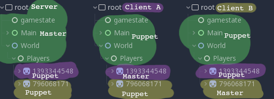

# Godot Networking Basics

### Docs
You should get acquainted with these classes at some point: [Node](https://docs.godotengine.org/en/3.1/classes/class_node.html), [SceneTree](https://docs.godotengine.org/en/3.1/classes/class_scenetree.html), [NetworkedMultiplayerENet](https://docs.godotengine.org/en/3.1/classes/class_networkedmultiplayerenet.html). 

I will cover only a handful of their parts today.

### Requirements
* Godot 3.1.1, the abilities to read English and follow basic instructions.
* Being able to search the web for answers is a strongly recommended skill, though not required.

# Tutorial
## Introduction
Godot has a nice system for high level multiplayer, and today we will explore it in the context of a server/client network architecture. In Godot, functions are by default called locally. For example, if you game has `func foo()`, you can call `foo()` and have that function be executed. But what if you want to execute code on another instance of your game? For that Godot has some special function keywords, and the rpc system. RPC stands for "Remote Procedure Call". We will look into what the keywords mean below. 

Something to keep in mind: RPCs work like other functions, but are sent over the network. This means that the node path has to be the same both on the instance that is sending the call, and the one receiving it. Otherwise you get errors saying something about node path not found.

In the future we will run both client and server instances. The nice thing about splitting things up this way, is that the server needs to only have game logic implemented, and has no need for graphics, audio, or UI, whereas the client doesn't need to have the logic parts. In practice, I have some art on my servers so it is easier to debug while developing. When actually hosting server, it will be via terminal and we won't have need for graphics or audio anyways. 

##### Keywords
Server: the one hosting the game.

Client: the one playing the game.

Local: Depending on context, either on server or on client.

Master: "Owner" of a node. For example, when Client A connects to server, we spawn a Player A and set it's master to be Client A. That way Client A can issue move commands. When Client B connects, it can't control Player A because it is not it's master. "Master" is more general, but this is the how you can think of it for now. Here is an example of server with two clients, where each is on a different computer. Keep this picture in mind, but don't worry about understanding it too much yet:



## Basic Ideas
Let's start with an example. Assume server is running and our networking code works:

<table>
<tr>
<th>Client script attached to node at "/root/Node"</th>
<th>Server script attached to node at "/root/Node"</th>
</tr>

<tr>

<td>
<pre>
func _ready():
    rpc("server_func")
</pre>
<pre>
remote func client_func():
    print("Client was called")
</pre>
</td>

<td>
<pre>
remote func server_func():
    print("Server was called")
</pre>
</td>

</tr>
</table>


When client connects, you will see "Server was called" printed on the server, and nothing on the client. The following example is even more interesting:

<table>
<tr>
<th>Client script attached to node at "/root/Node"</th>
<th>Server script attached to node at "/root/Node"</th>
</tr>

<tr>

<td>
<pre>
func _ready():
    rpc("print_func")
</pre>
<pre>
remote func print_func():
    print("Client was called")
</pre>
</td>

<td>
<pre>
remote func print_func():
    print("Server was called")
</pre>
</td>

</tr>
</table>

Here you would still see a message printed server side but nothing client side! Why is that? Because the RPCMode of the client function is `remote`. If we changed it to `remotesync`, we would see message printed client side as well.

Let us take a closer look at these RPCModes. You can find them on docs [here](https://docs.godotengine.org/en/3.1/classes/class_multiplayerapi.html#enumerations).

|       RPCMode       |   Keyword  | Description                                                                                                                                                   | Use Case Example                                                                         |
|:-------------------:|:----------:|---------------------------------------------------------------------------------------------------------------------------------------------------------------|------------------------------------------------------------------------------------------|
|  RPC_MODE_DISABLED  |            | Default, means networking disabled.                                                                                                                           | When no networking is required.                                                          |
|   RPC_MODE_REMOTE   |   remote   | Marks function or property as one that will be called/changed remotely, but not locally.                                                                      | Client connects to server, server calls `register_new_player` on all clients.                |
| RPC_MODE_REMOTESYNC | remotesync | Marks function or property as one that will be called/changed remotely and locally.                                                                           | Useful for P2P.                                                                          |
|   RPC_MODE_MASTER   |   master   | Marks function/property to be called/changed remotely ONLY ON the network master for this node. Calls/changes only accepted from this node's network puppets. | Useful for P2P.                                                                          |
| RPC_MODE_MASTERSYNC | mastersync | Same as above, but also calls/changes function/property locally.                                                                                               | Useful for P2P.                                                                          |
|   RPC_MODE_PUPPET   |   puppet   | Marks function/property to be called/changed remotely ONLY ON the network puppets for this node. Calls/changes only accepted from this node's network master. | Consider player movement: the network master of player sets a puppet_pos via `rset_unreliable("puppet_pos", position)` and everyone else syncs to it via `position = puppet_pos`|
| RPC_MODE_PUPPETSYNC | puppetsync | Same as above, but also calls/changes function/property locally.                                                                                               | Have a `puppetsync var score` variable on server and clients, set it via server when score changes. |

You can mark a function as remote, and variable as puppet by doing `remote func foo():` and `puppet var x` respectively.

With networking, each client/server has a network_id. The id of 1 is reserved for the server. Note that the server is also the default network master of every node.

## Networking Parts Descriptions

#### Node
[`is_network_master()`](https://docs.godotengine.org/en/3.1/classes/class_node.html#class-node-method-is-network-master) returns whether the local system is master of this node. Useful to check before grabbing player input or updating GUI. 

Next we have our rpc functions. Both `rpc(args)` and `rset(args)` have variations called `func_unreliable(args)`, `func_id(int id, args)`, and `func_id_unreliable(int id, args)`. Refer to [Node docs](https://docs.godotengine.org/en/3.1/classes/class_node.html). By default, Godot checks to make sure all rpc calls reach their destinations. With the unreliable variants however, this is not the case. Unreliable calls are sent, but not checked for whether they arrive. This makes them much faster at the cost of potentially dropping packets. Generally good for something like updating positions: even if multiple packets drop per second, your clients will be synced quite well.


[`rpc(String method, ...)`](https://docs.godotengine.org/en/3.1/classes/class_node.html#class-node-method-rpc) is what you use to call methods. It will call functions by the RPCMode table above. For example:


<table>
<tr>
<th>Client script attached to node at "/root/Node"</th>
<th>Server script attached to node at "/root/Node"</th>
</tr>

<tr>

<td>
<pre>
func _ready():
    rpc_id(1, "server_func", "Hello Server!")
</pre>
<pre>             
remote func client_func():
    print("Client was called")
</pre>
</td>
<td>
<pre>
remote func server_func(print_this):
    print(print_this)
</pre>
</td>

</tr>
</table>

will result in "Hello Server" being printed on the server. After the "`String method`" argument, we can specify more args that we require and they will also be sent over network.

[`rset ( String property, Variant value )`](https://docs.godotengine.org/en/3.1/classes/class_node.html#class-node-method-rset) is similar except it sets a property as specified by the RPCMode table above. Here is the score example again:

<table>
<tr>
<th>Client script attached to node at "/root/Node"</th>
<th>Server script attached to node at "/root/Node"</th>
</tr>

<tr>

<td>
<pre>
puppet var score
</td>

<td>
<pre>puppetsync var score = 0</pre>
<pre>
func _on_score_update(new_score):
    rset("score", new_score)
</pre>
</td>
</tr>
</table>

When `_on_score_update(new_score)` is called on server, both the server's score and all clients score will be updated.

#### SceneTree
Refer to [SceneTree docs](https://docs.godotengine.org/en/3.1/classes/class_scenetree.html) for more info. 

[`NetworkedMultiplayerPeer network_peer`](https://docs.godotengine.org/en/3.1/classes/class_scenetree.html#class-scenetree-property-network-peer) is what makes the network magic happen. We use this in both server/client to enable networking, and in client when server disconnects. Usually you'll see the setter get used instead of assigning directly: `set_network_peer(val)`.

[`get_network_unique_id ()`](https://docs.godotengine.org/en/3.1/classes/class_scenetree.html#class-scenetree-method-get-network-unique-id) returns the local network id. Useful when communicating, so that server/clients can know exactly who they are talking to.

[`get_rpc_sender_id()`](https://docs.godotengine.org/en/3.1/classes/class_scenetree.html#class-scenetree-method-get-rpc-sender-id) returns the id of whoever called the current RPC function. If not inside an RPC it returns 0.

###### Client Signals
[`connected_to_server ()`](https://docs.godotengine.org/en/3.1/classes/class_scenetree.html#signals) is a signal fired when a client connect to a server.

[`connection_failed ()`](https://docs.godotengine.org/en/3.1/classes/class_scenetree.html#signals) is a signal fired when a client is unable to connect to server.

[`server_disconnected ( )`](https://docs.godotengine.org/en/3.1/classes/class_scenetree.html#signals) is a signal fired when server disconnects from client.

###### Server Signals
[`network_peer_connected (int id)`](https://docs.godotengine.org/en/3.1/classes/class_scenetree.html#signals) is signal fired when client connects to server.

[`network_peer_disconnected (int id)`](https://docs.godotengine.org/en/3.1/classes/class_scenetree.html#signals) is signal fired when client disconnects from server.

#### NetworkedMultiplayerENet
Refer to full [NetworkedMultiplayerENet docs here](https://docs.godotengine.org/en/3.1/classes/class_networkedmultiplayerenet.html).

[`create_client (String address, int port)`](https://docs.godotengine.org/en/3.1/classes/class_networkedmultiplayerenet.html#class-networkedmultiplayerenet-method-create-client) allows us to create a client. For example, you may have something like:
```
func connect_to_server():
	var host = NetworkedMultiplayerENet.new()
	host.create_client(ip, DEFAULT_PORT)
	get_tree().set_network_peer(host)
```

[`create_server (int port, int max_clients=32)`](https://docs.godotengine.org/en/3.1/classes/class_networkedmultiplayerenet.html#class-networkedmultiplayerenet-method-create-server) is similar and allows us to create a server. On the server, you may have something like:
```
func create_server():
	var host = NetworkedMultiplayerENet.new()
	host.create_server(DEFAULT_PORT, MAX_PLAYERS)
	get_tree().set_network_peer(host)
```


## Conclusion
You should now be aware of the fundamental things needed to start creating a multiplayer game with Godot using the server/client architecture. Congrats!

Next, [go here](GCPTutorial/GCPTut.md) to look at a barebones project with a client and server, and learn how to host the server via Google Cloud Platform! 

Cheers


